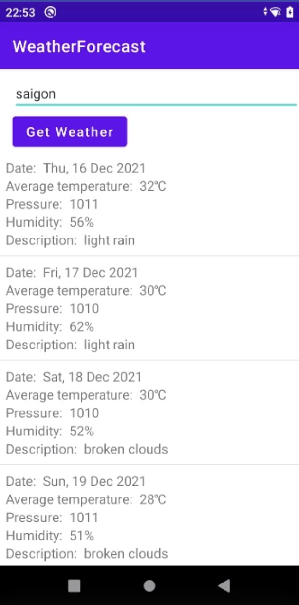

WeatherForecast
=================
A simple WeatherForecast app to retrieve weather information based on their searching criteria 
and render the searched results on dashboard screen

Architecture & Libraries Used
--------------

- Architecture: Clean Architecture, MVVM
- Libraries:
    * Retrofit: REST client for Java & Android
    * Hilt: for Dependency Injection
    * LiveData: is an observable data holder class.
    * Coroutines:  A coroutine is a concurrency design pattern that you can use on Android to
      simplify code that executes asynchronously...
    * Android Jetpack's Navigation: implement navigation in app
    * Arrow-kt: Functional companion to Kotlin


Installation
=================
Currently this source code exclude apiKey file for security, so if you want to run it on your machine,
please create an [apiKey.properties] at your root project and provide these information.
```groovy
API_KEY=PutYourKeyHere
```

What I've done
--------------
1. The application is a simple Android application which is written by Kotlin.
2. The application is able to retrieve the weather information from OpenWeatherMapsAPI.
3. The application is able to allow user to input the searching term.
4. The application is able to proceed searching with a condition of the search term length
   must be from 3 characters or above.
5. The application is able to render the searched results as a list of weather items.
6. The application is able to support caching mechanism so as to prevent the app from
   generating a bunch of API requests.
7. The application is able to manage caching mechanism & lifecycle.(not sure this point)
8. The application is able to handle failures.
9. The application is able to support the disability to scale large text for who can't see the text
   clearly. (by using sp for text)
   

Screenshots
-----------


